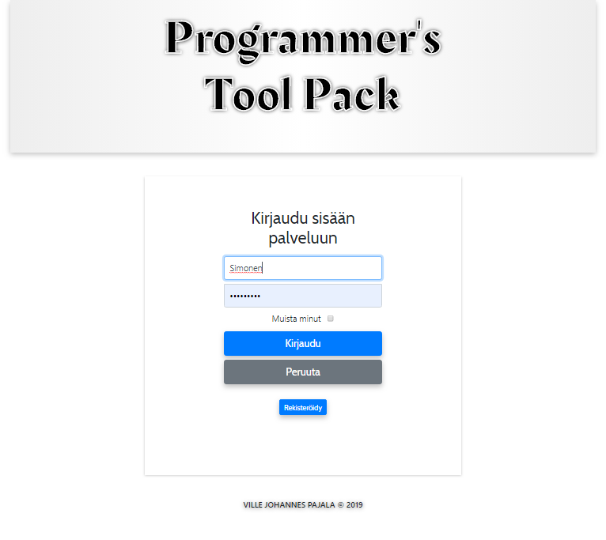
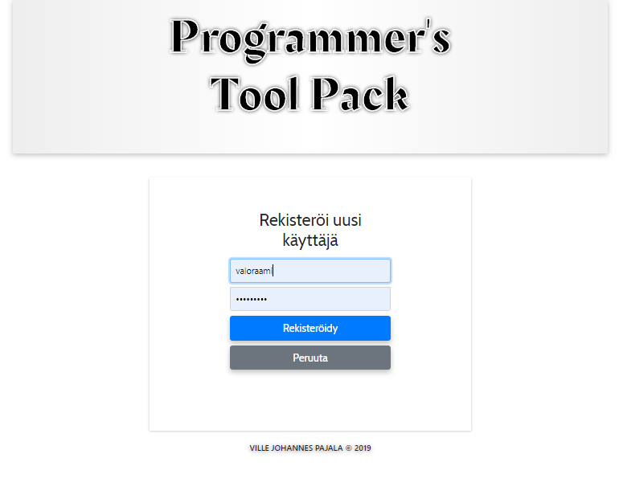
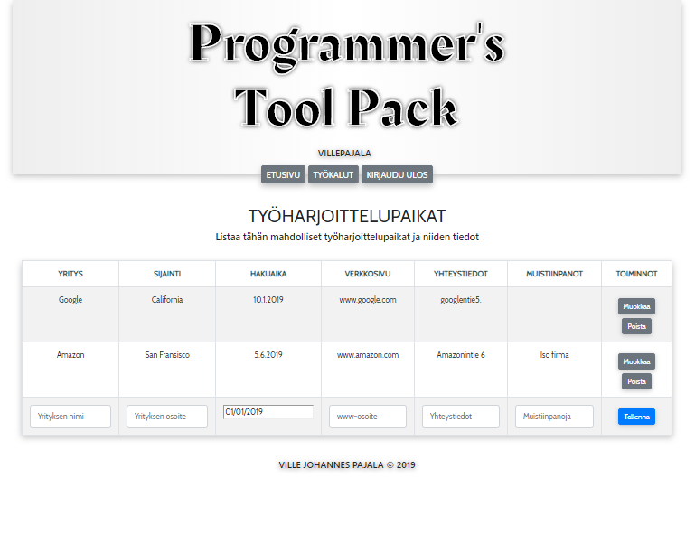

# Programmers tool pack

A web app for collecting useful resources for programmers and programming students.

### Current Features

* The front page shows latest news from TechCrunh
* User can register and / or login to the service
* In Registeration, the new user is saved to the database
* If logged in, user can search TechCrunch news with any search word
* Logged in User can access the tool for listing possible internship organisations
* List data is saved to database for registered user to add, modify and delete his / her data

### Tech Used

* Node.js
* Express.js
* EJS
* MySql
* JavaScript
* HTML
* CSS
* Bootstrap 4

### Screnshots

